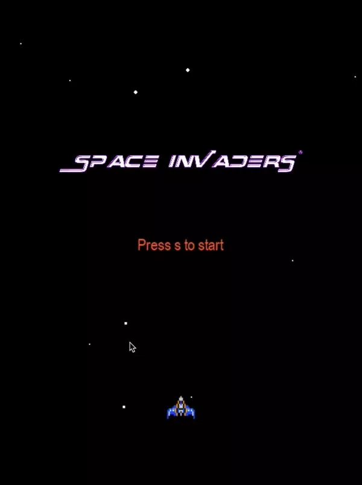

# SPACE INVADERS 👾
## by Oscar Gonzalez, Blanca Ruiz and Pol Tedesko

</img>

To run this game, clone this repository with:
```bash
$ git clone https://github.com/poltm13/space-invaders.git
$ cd space-invaders
```
or simply download the source code as zip

You will need to install the following packages:

### Linux
```bash
$ sudo apt-get install libglfw3
$ pip install p5 --user
```
or
### MacOs
```bash
$ brew install glfw
$ pip install p5 --user
```

To play the game just run the *sketch.py* script
